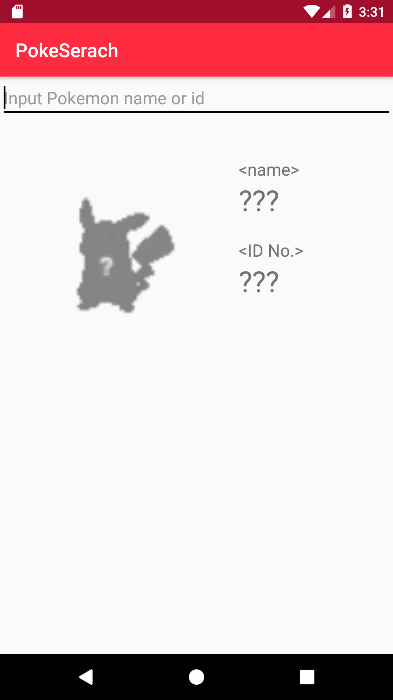
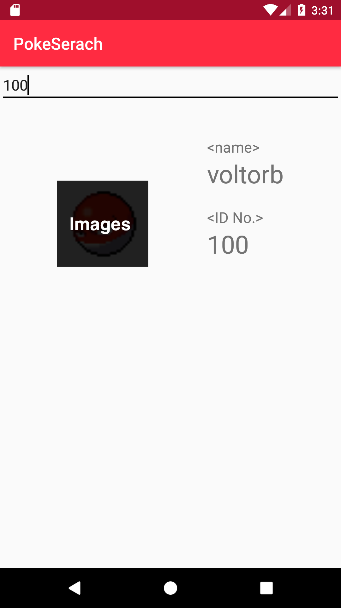
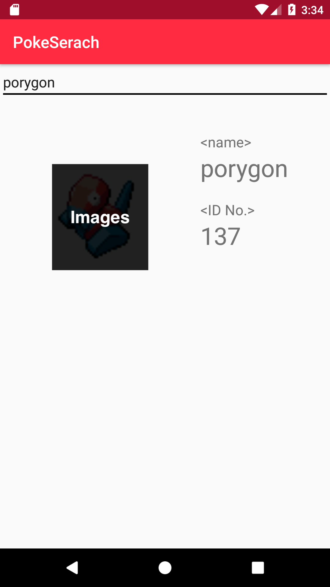

# poke-search
Demonstration of MVP architecture

  

- Search pokemon by name
- Search pokemon by id

## Credit
- Kotlin(Jetbrains)
- [Retrofit2](https://square.github.io/retrofit/)
- ReactiveX
    - [RxJava](https://github.com/ReactiveX/RxJava)
    - [RxKotlin](https://github.com/ReactiveX/RxKotlin)
    - [RxAndroid](https://github.com/ReactiveX/RxAndroid)
- [Glide](https://github.com/bumptech/glide/tree/v4.8.0)
- [Koin for Android](https://insert-koin.io/)
- [PokeApi](https://pokeapi.co/)

## References
- [Android Architecture Blueprints](https://github.com/googlesamples/android-architecture)
